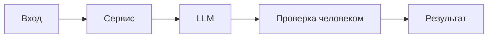

# ADR: решение для первого рабочего сценария

- Статус: proposed
- Дата: 2026-09-20
- Ответственные: команда практики

## Контекст

Учебный PR добавляет эндпоинт POST `/api/reviews` и сервис `ReviewService.review`, формирующий промпт и вызывающий `LLM.generate`. В текущем виде отсутствует валидация входа, лимит размера diff, таймаут и обработка ошибок LLM, а также редактирование секретов.

## Решение

Для первого рабочего сценария сохранить простой формат ответа `{"comment": str}`, но добавить нефункциональные требования в план:
- Валидация наличия и типа `diff`; 4xx на невалидном запросе.
- Лимит размера diff 20 000 символов с 413 (API-1).
- Таймаут LLM 10с и контролируемая ошибка (REL-1).
- Соблюдать SEC-1 (редактирование секретов) перед отправкой в LLM.

## Рассмотренные альтернативы

| Альтернатива | Почему не выбрали сейчас |
|---|---|
| Расширенный контракт OUT-1 (summary/risks/checks) в API | Усложняет MVP и совместимость; пока оставляем только `comment` |
| Потоковая генерация (stream) | Не требуется для первого сценария; усложняет реализацию и тесты |
| Синхронные ретраи на уровне сервиса | Повышает латентность; лучше оставить на уровень клиента/оркестрации |

## Последствия и главный риск

- Положительные последствия:
  - Предсказуемое поведение API, меньше 5xx на невалидных запросах.
  - Контролируемые таймауты и отказоустойчивость к LLM-сбоям.
- Ограничения:
  - Ответ по-прежнему плоский (`comment`), без структурированных рисков.
- Главный риск:
  - Утечка секретов при отсутствии корректной редакции (SEC-1).
- Как проверим риск:
  - Тест с искусственным секретом в diff и проверкой, что в prompt он заменён на `[REDACTED]`.

## Архитектурная схема

## Как использовали AI

- Для чего: Зафиксировать решение по первому сценарию и компромиссы.
- Тип промпта: master prompt
- Строка в [`prompts.md`](prompts.md): P1-02
- Что проверили и исправили сами: Согласовали правила CASE с фактическим diff; уточнили риски и проверки.
