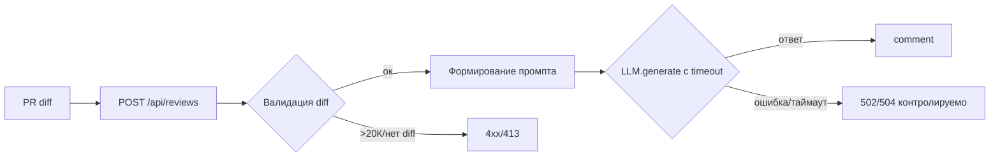

# Анализ процесса: AS IS и TO BE

## AS IS

Событие: появляется PR, клиент отправляет diff в наш сервис.
Процесс: FastAPI принимает POST `/api/reviews`, извлекает `payload["diff"]` без валидации и вызывает `review_service.review`. Сервис формирует промпт и синхронно вызывает `LLM.generate`. Ошибки и таймауты не обрабатываются. Результат — `{ "comment": answer }`.
Участники: Клиент (разработчик/CI), FastAPI, ReviewService, внешний LLM.
Задержки: время ответа внешнего LLM не ограничено; при больших диффах возможны значительные задержки.
Точки потери информации: отсутствие явной структуры ответа (только `comment`), отсутствие логов содержимого (по OBS-1 это и не требуется), отсутствие кодов 4xx на невалидном входе.

## TO BE

Добавлен слой валидации входа и ограничение размера `diff` (413 при >20К). Вызов LLM обёрнут таймаутом 10с и контролируемой обработкой ошибок. Ответ остаётся `{ "comment": str }`, но поведение по ошибкам предсказуемо: 4xx для неверного запроса, 5xx/502/504 контролируемо для внешних сбоев.

## Разница

| Что меняется | AS IS | TO BE | Как проверим изменение |
|---|---|---|---|
| Валидация входа | Нет | 422/400 при отсутствии diff | E2E «нет diff» |
| Лимит размера | Нет | 413 при >20К | Нагрузочный сценарий 20 001 символ |
| Таймаут LLM | Нет | 10с, контролируемая ошибка | Интеграция со стабом-таймаутом |
| Метрики успеха | Неопределены | >=99% 2xx на валидном, 100% 4xx на невалидном | Метрики из problem.md |

## Как использовали AI

- Для чего: Сформулировать изменения процесса вокруг учебного PR.
- Тип промпта: master prompt
- Строка в [`prompts.md`](prompts.md): P1-02
- Что проверили и исправили сами: Сопоставили блок-схему с правилами CASE (API-1, REL-1) и тест-планом.
