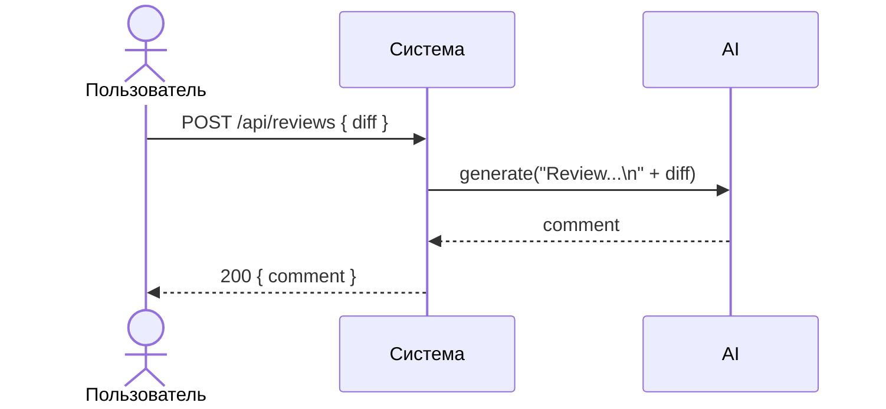

# Use cases и user stories

## Первый рабочий сценарий

**Когда** клиент (разработчик или CI) отправляет POST `/api/reviews` с JSON `{"diff": "<git diff>"}`, **система** формирует промпт и запрашивает LLM, **а пользователь получает** JSON-ответ с ключом `comment` с авто‑замечаниями по PR.

Не входит в этот сценарий:

- Аутентификация и авторизация
- Публикация комментариев в GitHub
- Сложная структура ответа помимо `comment`

## Use case

| Поле | Значение |
|---|---|
| Актор | Разработчик/CI, вызывающий API |
| Триггер | Появился diff PR, требуется авто‑ревью |
| Предусловия | Сервис доступен по HTTP; LLM провайдер доступен |
| Основной результат | Ответ 200 с `{ "comment": "..." }` для валидного тела |
| Ошибка или отказ | 422/400 при отсутствии `diff`; 413 при превышении лимита; контролируемый 502/504 при ошибке LLM |



## User stories и acceptance criteria

```gherkin
Feature: Авто‑ревью по diff

  Scenario: Позитивный ответ
    Given запущен сервис и доступен LLM
    When я отправляю POST /api/reviews с телом {"diff": "diff --git a/x b/x\n..."}
    Then получаю 200 и JSON с ключом comment

  Scenario: Нет поля diff
    Given запущен сервис
    When я отправляю POST /api/reviews с телом {}
    Then получаю 422 или 400 с сообщением об обязательном поле diff

  Scenario: Дифф слишком большой
    Given запущен сервис
    When я отправляю POST /api/reviews с diff длиной 20001 символ
    Then получаю 413 Payload Too Large
```

## Как использовали AI

- Для чего: Сформулировать минимальный рабочий сценарий и критерии приёмки из diff и правил CASE.
- Тип промпта: master prompt
- Строка в [`prompts.md`](prompts.md): P1-02
- Что проверили и исправили сами: Согласовали границы сценария с SCOPE-1 и формат ответа с OUT-1.
