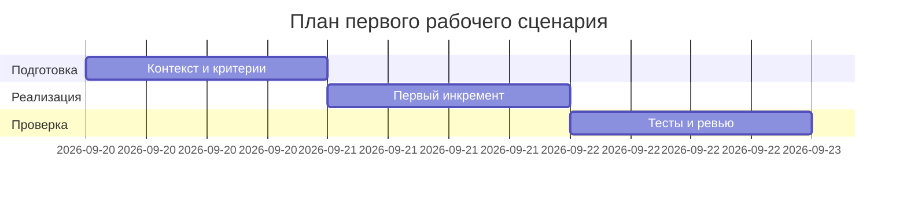

# План поставки

## Инкременты и ответственность

| Инкремент | Наблюдаемый результат | Что делает человек | Что делает AI или субагент | Проверка | Зависимости |
|---|---|---|---|---|---|
| 1 | Описан первый сценарий и риски | Уточняет контекст и границы | Генерирует summary/risks/checks по diff | P1-02_answer.md | TRAINING_PR.diff, CASE.md |
| 2 | Тест-план (unit/integration/e2e) | Утверждает критерии | Предлагает таблицы тестов | tests_*.md заполнены | Инкремент 1 |
| 3 | Нагрузочный план и метрики | Выбирает метрики | Генерирует кандидатов и сводит с лимитами | tests_load.md, problem.md | Инкремент 2 |

## Диаграмма Ганта

Замените даты и задачи на свой план.

## Как использовали AI

- Для чего: Сформировать план поставки и проверки вокруг учебного PR.
- Тип промпта: master prompt
- Строка в [`prompts.md`](prompts.md): P1-02
- Что проверили и исправили сами: Синхронизировали артефакты и зависимости между файлами; поправили даты под текущий спринт.
