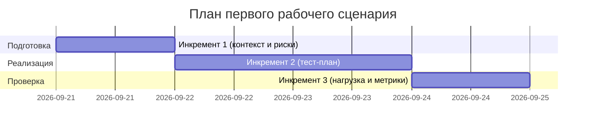

# План поставки

## Инкременты и ответственность

| Инкремент | Наблюдаемый результат | Что делает человек | Что делает AI или субагент | Проверка | Зависимости |
|---|---|---|---|---|---|
| 1 | Описан первый рабочий сценарий и риски. Окно: 2026-09-21 (1 день) | Инженер А уточняет контекст и границы в соответствии с CASE (SCOPE-1, QA-1) | AI-ассистент формирует summary/risks/checks по diff | P1-02_answer.md; context.md (Context Pack); ссылки на TRAINING_PR.diff и CASE.md | TRAINING_PR.diff, CASE.md |
| 2 | Тест-план (unit/integration/e2e) актуализирован. Окно: 2026-09-22..2026-09-23 (2 дня) | Инженер Б утверждает критерии приёмки, синхронизирует tests_unit.md, tests_integration.md, tests_e2e.md с API-1/REL-1 | AI-ассистент предлагает таблицы тестов и проверяемые сценарии | tests_unit.md, tests_integration.md, tests_e2e.md содержат ссылки на строки diff и правила CASE (API-1, REL-1, QA-1) | Инкремент 1 |
| 3 | Нагрузочный план и метрики уточнены. Окно: 2026-09-24 (1 день) | Инженер А выбирает метрики и пороги по API-1; согласует с problem.md | AI-ассистент генерирует кандидатов сценариев (10К→30К, rps=10) | tests_load.md (лимит 20 000 символов → 413), problem.md (метрики 2xx/4xx, латентность) | Инкремент 2 |

## Диаграмма Ганта

Даты и длительности согласованы с инкрементами выше; при изменении — обновить оба раздела.

## Как использовали AI

- Для чего: Сформировать план поставки и проверки вокруг учебного PR.
- Тип промпта: master prompt
- Строка в [`prompts.md`](prompts.md): P1-02
- Что проверили и исправили сами: Синхронизировали артефакты и зависимости между файлами; поправили даты под текущий спринт.
